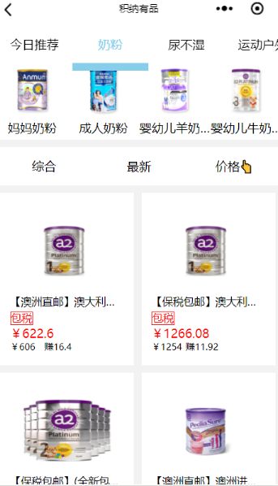
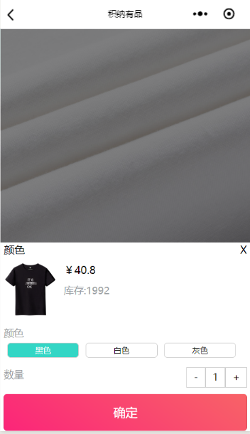
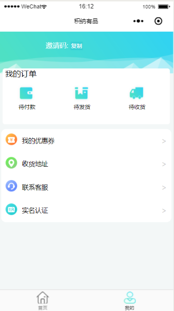

# npvue
高仿积纳优品
## 
本项目基于[WX小程序开发](https://developers.weixin.qq.com/miniprogram/dev/framework/),使用npvue开发

## 技术点
* wx小程序
* vue
* vuex(数据管理)
* 小程序登陆权限
* async
* flyio
* swiper-view
* canvas

## 实现功能
* 首页
* 分类页
* 搜索
* 购买详情页 
  1.swiper 
  2.canvas 
  3.购物车 
  4.数据列表 
* 个人中心 
  1.代付款 
  2.收货地址 
  3.联系客服 
  4.实名认证 

## 运行

### `npm install`
安装项目依赖包

### `npm run dev`
运行开发环境，注意将`config/dev.env.js`中的接口地址改成线上的地址，对应`prod.env.js`，端口只能使用`3010`

### `npm run build`
打包客户端和服务端，运行生产环境前必须先打包

### `npm run start`
运行生产环境

## 屏幕截图
  
  
  
  
  
  
  
